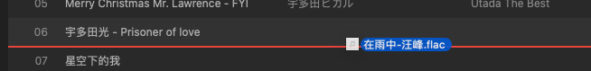
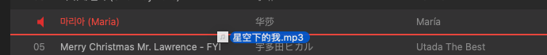

概述：<br>
我们在配合使用 NSTableView/NSOutlineView 和 NSmenu 的时候，会发现右键cell时，会多出一个蓝色的边框;<br>
拖入文件到tableview里时，cell上也会多出一个下划线;<br>
这里介绍如何拦截并修改它们

<!-- more -->

# 一、右键cell时的边框

## 分析

- 右键cell后，边框的样子如下，很突兀:


- 实际上，就是在tableView上 addSubview 了一个 NSMenuHighlightView：


## 解决方式

>暴力点，直接重写NSTableView的addSubview方法，拦截掉NSMenuHighlightView的添加:

```swift
class DNTableView: NSTableView {
    // 禁止右键 cell 边框
    override func addSubview(_ view: NSView) {
        if view.className != "NSMenuHighlightView" {
            super.addSubview(view)
        }
    }
}
```

# 二、拖入文件时的下划线

>当然也可以通过设置 `tableView.draggingDestinationFeedbackStyle = .none` 直接隐藏，但是我更想修改它的颜色

- 首先看看它的样子


- 其实原理和上面边框处理一样，也是通过重写addSubView进行拦截
```swift
// 禁止右键cell 边框
    override func addSubview(_ view: NSView) {
        if view.className == "NSMenuHighlightView" { // 右键后cell上的线
            return
        } else if view.className == "NSDraggingDestinationView" { // 拖动文件后，cell上的线
            // 发现无法修改view的背景色，无奈只能覆盖一个color view，以后发现更好的修改方式再改
            let newLineView = NSView()
            newLineView.frame = view.bounds
            newLineView.wantsLayer = true
            newLineView.layer?.backgroundColor = kRedHighlightColor.cgColor
            view.addSubview(newLineView)
            super.addSubview(view)
        } else {
            super.addSubview(view)
        }
    }
```

- 再来看看修改后的样子
