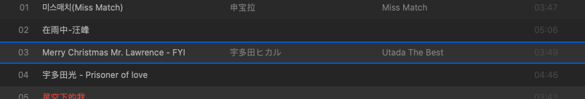
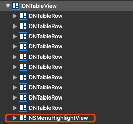

概述：<br>
我们在配合使用 NSTableView/NSOutlineView 和 NSmenu 的时候，会发现右键cell时，会多出一个蓝色的边框，这里介绍如何删除它

<!-- more -->

## 分析

- 右键cell后，边框的样子如下，很突兀:


- 实际上，就是在tableView上 addSubview 了一个 NSMenuHighlightView：


## 解决方式

>暴力点，直接重写NSTableView的addSubview方法，拦截掉NSMenuHighlightView的添加:

```swift
class DNTableView: NSTableView {
    // 禁止右键 cell 边框
    override func addSubview(_ view: NSView) {
        if view.className != "NSMenuHighlightView" {
            super.addSubview(view)
        }
    }
}
```